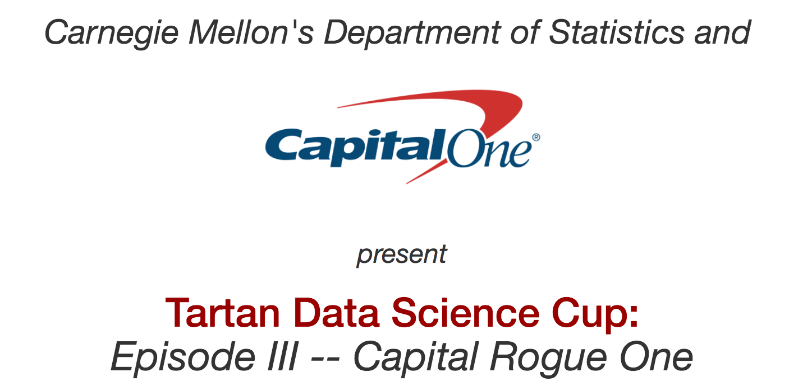

# Tartan Data Science Cup III

<div align="center">
  <br><br>
</div>

## Abstract
[Tartan Data Science Cup III](http://www.stat.cmu.edu/tartandatasciencecup/episodeIII/index.html)

- Host : [**Capital One**](https://www.capitalone.com/)
- Prize : AppleTV + USD 50 Amazon Card
- Problem : Binary Classification
- Evaluation : [Brier](https://en.wikipedia.org/wiki/Brier_score)
- Period : Feb 4 2017 9AM ~ 6PM (9 hours)

People take out loans for numerous reasons: To pay for college, to buy a house or pay for renovations, to purchase a car, to refinance or consolidate existing debt, and to pay for big events (e.g. weddings, vacations, etc), among other reasons. 

From the perspective of the lender, it would be useful to know if there are important differences in the features of the loans or borrowers that correspond to the differences in the likelihood that the loan is paid off. 

You work for a company that issues loans. Your company's data servers malfunctioned, causing some of the data to be "corrupted." Important information about the loans in the corrupted data was lost, including the repayment status of these loans. 

Using the complete, uncorrupted data, your task is to predict the repayment statuses of the corrupted loans. In particular, you are asked to predict if the loan status is in one of the following groups:

- Group 0: "**Good**" -- The loan is fully paid off ("Fully Paid"), in its grace period ("In Grace Period"), or currently being paid back ("Current"). 

- Group 1: "**Bad**" -- The loan is in default ("Default"), payment on the loan is late ("Late (16-30 days)" or "Late (31-120 days)"), or the loan has been charged off ("Charged Off").

## Result
| Brier Score | Numeric Only (9) | + Categorical (26) | + new features (29) | outlier clipping | 
|:----------:|:----------:|:---------:|:----:|:----------:|
| RandomForest | 0.0898 | 0.0857 | 0.0855 | 0.0854 |
| LogisticRegression | - | - | - | 0.0861 |
| ExtraTrees | - | - | - | 0.0854 |
| XGBoost | - | - | - | 0.0844 |

## How to Run

**[Data]** 

Place data in ```input``` directory. 

**[Code]**

Above results can be replicated by runinng all commands in ```anything_random.ipynb``` notebook.

Make sure you are on Python 3.5.2 with library versions same as specified in requirements.txt

## Objective
- Competition required us to submit 2~3 pages of report, describing the problem, methods and results of our machine learning pipeline.
- Also, finalists were selected to make 5-min presentation, tested on effective communication of their work.

## Result
